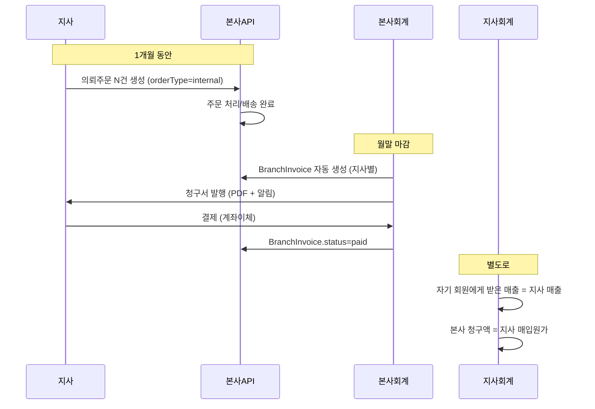

# 지사(Branch Office) 시스템 상세 기획서

> 작성일: 2026-04-30
> 작성 브랜치: `claude/add-branch-office-system-3mtux`
> 상태: **초안 (구현 전 합의용)**

---

## 0. 한 줄 요약

본사(Photocafe)가 직접 운영해 온 ERP/쇼핑몰을 **반-독립 사업자인 “지사(Branch)”** 가
자기 회원·주문·세금계산서·다운로드를 직접 운영할 수 있도록 확장한다.
지사는 본사 시스템 안의 **테넌트(tenant)** 로 살되, 사업자번호·세금책임·결제정책·
서브도메인(`{지사}.photocafe.co.kr`)은 분리한다.

지사는 동시에 **본사의 B2B 고객**이기도 하다 — 출력만/앨범/반제품을 본사에
의뢰할 수 있고, 본사는 지사에게 청구한다.

---

## 1. 용어 정의

| 용어 | 영문 | 설명 |
|---|---|---|
| 본사 | Headquarters (HQ) | Photocafe 본체. `Branch.isHeadquarters=true` 1건. |
| 지사 | Branch Office | 사업자번호를 가진 반-독립 운영 주체. 다수. |
| 지사 직원 | Branch Staff | 해당 지사에 소속된 `Staff`. 다른 지사 데이터 접근 불가. |
| 지사 회원 | Branch Client | 지사 서브도메인으로 가입한 `Client`. 지사 소속. |
| 지사 주문 (B2C) | Branch Order | 지사 회원이 지사에 낸 주문. 지사가 매출. |
| 의뢰 주문 (B2B) | Internal Order | 지사가 본사에 출력/앨범/반제품을 의뢰. 본사가 매출, 지사가 매입. |
| 테넌트 | Tenant | 데이터 격리 단위. 본 시스템에서는 `branchId` 기준. |

---

## 2. 비즈니스 요구사항 (확정본)

### 2.1 지사가 직접 수행하는 업무
1. 자기 회원의 가입 승인·관리·등급 부여
2. 자기 회원이 발주한 주문의 **접수/접수완료/생산진행/배송준비** 단계 관리
3. **매출세금계산서 발행** (지사 사업자번호로, 지사회원에게 직접)
4. **거래명세서/견적서 작성** (지사 사업자정보 표기)
5. 자기 회원이 업로드한 **이미지 원본 다운로드**
6. 자기 회원과의 **결제 수금/미수금 관리**

### 2.2 결제 방식 (지사가 자기 회원에게 적용)
| 코드 | 명칭 | 설명 |
|---|---|---|
| `prepaid` | 선입금 | 주문 전 충전 → 차감 |
| `credit` | 신용거래 | 월말/익월 정산 (기존 `creditEnabled` 재활용) |
| `on_order` | 주문시입금 | 주문 생성 시 무통장입금 (기본값) |
| `card` | 카드결제 | 주문 생성 시 PG 카드결제 (지사 PG 계정으로 직접 수금) |

지사 단위로 **허용 결제방식 화이트리스트**(`Branch.allowedPaymentTypes`) 보유.

> **카드결제 추가 고려사항**
> - **PG 계약 주체**: 지사 사업자번호로 자체 PG(토스페이먼츠/나이스페이/KG이니시스 등) 계약 →
>   매출은 지사 통장으로 직접 입금 (세금계산서 발행자와 일치)
> - `Branch.pgProvider`, `Branch.pgMerchantId`, `Branch.pgApiKey`(암호화) 필드 추가 필요
> - 본사 PG 를 공용으로 쓰는 옵션도 가능하나 정산이 복잡 → **지사별 PG 계정 권장**
> - 카드결제 수수료(약 2.5~3%)는 지사가 부담 (단가 정책에 반영 권장)
> - 부분취소/환불 처리는 PG 별 SDK 차이 있음 — 1차 범위에서는 “전체 취소만” 으로 한정 권장

### 2.3 서브도메인 / 도메인
- `{branchCode}.photocafe.co.kr` (예: `seoul.photocafe.co.kr`)
- DNS: Cloudflare 와일드카드 `*.photocafe.co.kr` → Vercel
- 가입은 서브도메인에서만 → `Client.branchId` 자동 설정
- 추후 자체 도메인(`Branch.customDomain`)도 매핑 가능 (Vercel 도메인 추가)

### 2.4 본사 ↔ 지사 거래 (의뢰 주문)
지사가 본사에 다음 3종을 의뢰할 수 있다:
| 의뢰 종류 | `internalOrderType` | 본사 처리 |
|---|---|---|
| 출력만 의뢰 | `print_only` | 인쇄·후가공·발송 (앨범 제본 제외) |
| 앨범 의뢰 | `album` | 앨범 풀공정 (인쇄·제본·검수·발송) |
| 반제품 의뢰 | `half_product` | 반제품(속지/표지/케이스 등) 단위 공급 |

본사는 지사에게 **월 정산서**를 발행 (본사가 발행자, 지사가 수신자).

---

## 3. 권한·접근 제어 정책

### 3.1 역할 (Role) 체계 확장

| 기존/신규 | role | 데이터 범위 | 비고 |
|---|---|---|---|
| 기존 | `superadmin` (`isSuperAdmin=true`) | 전체 | 본사·지사 모두 |
| 기존 | `employee` | `branchId` 기준 자기 지사 | 본사 직원이면 본사 직속만 |
| **신규** | `branch_admin` | 자기 지사 전체 | 지사 내 직원/회원/주문/세금/정산 모두 |
| **신규** | `branch_staff` | 자기 지사 (제한) | 회원/주문 처리. 정산/직원관리 불가 |

`Staff.role` 컬럼에 위 4종이 들어간다.

### 3.2 데이터 격리 — Row-Level Tenancy (추천)

> 데이터베이스/스키마 분리는 운영 부담이 너무 커서 채택하지 않는다.

- 모든 “지사 귀속 가능” 테이블에 `branchId` 컬럼 추가
- NestJS `BranchScopeInterceptor` 가 JWT 의 `branchId`/`role` 을 읽어
  Prisma 쿼리 `where` 절에 자동 주입
- 슈퍼관리자는 인터셉터 우회 (`x-branch-override` 헤더 또는 무필터)

**`branchId` 추가 대상 테이블 (1차):**
`Client`, `Order`, `Quotation`, `SalesLedger`, `PurchaseLedger`,
`ReturnRequest`, `Consultation`, `Notification` (수신자 기준은 기존 유지)

**`branchId` 미추가 (전사 공유):**
`Product`, `HalfProduct`, `Category`, `Paper`, `SystemSetting`,
`PermissionTemplate`, `Specification`(상품 규격) — 본사가 단일 마스터로 관리

### 3.3 권한 매트릭스

| 행위 | superadmin | branch_admin | branch_staff | 본사 employee |
|---|:-:|:-:|:-:|:-:|
| 지사 생성/삭제 | ✅ | ❌ | ❌ | ❌ |
| 지사 직원 등록 | ✅ | ✅(자기 지사) | ❌ | ❌ |
| 자기 지사 회원 관리 | ✅ | ✅ | ✅ | — |
| 다른 지사 회원 조회 | ✅ | ❌ | ❌ | ❌ |
| 자기 지사 주문 처리 | ✅ | ✅ | ✅ | — |
| 자기 지사 다운로드 | ✅ | ✅ | ✅ | — |
| 다른 지사 다운로드 | ✅ | ❌ | ❌ | ❌ |
| 자기 지사 세금계산서 발행 | ✅ | ✅ | ❌ | — |
| 본사↔지사 정산 | ✅ | 조회만 | ❌ | ✅ |
| 상품/규격 마스터 관리 | ✅ | ❌ | ❌ | ❌ |

---

## 4. 데이터 모델 변경

### 4.1 `Branch` 모델 확장

```prisma
model Branch {
  id                   String   @id @default(cuid())
  branchCode           String   @unique           // 서브도메인이 됨 (예: "seoul")
  branchName           String
  isHeadquarters       Boolean  @default(false)

  // 사업자 정보 (세금계산서 발행 주체)
  businessNumber       String?                    // 사업자등록번호
  representative       String?                    // 대표자명
  businessType         String?                    // 업태
  businessCategory     String?                    // 종목
  taxInvoiceIssuer     Boolean  @default(true)    // 지사 직접 발행 여부

  // 연락처/주소
  address              String?
  addressDetail        String?
  postalCode           String?
  phone                String?
  fax                  String?
  email                String?

  // 도메인 / 브랜딩
  subdomain            String   @unique           // 보통 branchCode 와 동일
  customDomain         String?  @unique           // 자체도메인 매핑 시
  logoUrl              String?
  themeColor           String?  @default("#000000")
  footerText           String?                    // 푸터 사업자정보 추가 문구

  // 결제 정책
  allowedPaymentTypes  String[] @default(["on_order"])  // prepaid|credit|on_order|card
  bankName             String?
  bankAccount          String?
  bankHolder           String?

  // 카드결제 (PG)
  pgProvider           String?                          // toss|nice|inicis|null
  pgMerchantId         String?                          // PG 가맹점 ID
  pgApiKeyEncrypted    String?                          // KMS/Secret 으로 암호화 저장
  pgEnabled            Boolean  @default(false)

  // 본사↔지사 정산
  commissionRate       Decimal  @default(0) @db.Decimal(5, 2)  // 본사 수수료 %
  settlementCycle      String   @default("monthly")            // monthly|biweekly
  settlementDay        Int      @default(31)                   // 마감일

  // 운영
  isActive             Boolean  @default(true)
  approvedAt           DateTime?
  contractStartDate    DateTime?
  contractEndDate      DateTime?
  adminMemo            String?

  createdAt            DateTime @default(now())
  updatedAt            DateTime @updatedAt

  staff                Staff[]
  clients              Client[]                   // 신규
  clientGroups         ClientGroup[]
  orders               Order[]                    // 신규
  internalOrders       Order[]   @relation("InternalRequester")  // 본사로의 의뢰
  branchInvoices       BranchInvoice[]            // 신규: 본사→지사 청구

  @@map("branches")
}
```

### 4.2 `Client` 변경
```prisma
model Client {
  // ...기존 필드
  branchId  String?              // 지사 귀속 (null = 본사 직속)
  branch    Branch?  @relation(fields: [branchId], references: [id])

  @@index([branchId])
}
```
- 가입 시 서브도메인 host 로 자동 결정
- 변경은 슈퍼관리자만 가능

### 4.3 `Order` 변경
```prisma
model Order {
  // ...기존 필드
  branchId            String?              // 접수 지사 (B2C 주문)
  orderType           String   @default("b2c")  // b2c | internal
  internalOrderType   String?              // print_only | album | half_product
  requesterBranchId   String?              // internal 일 때, 의뢰한 지사
  branch              Branch?  @relation(fields: [branchId], references: [id])
  requesterBranch     Branch?  @relation("InternalRequester", fields: [requesterBranchId], references: [id])

  @@index([branchId])
  @@index([orderType])
}
```
- B2C: `branchId=지사`, `orderType=b2c`, `clientId=지사회원`
- 의뢰: `branchId=본사`, `orderType=internal`, `requesterBranchId=지사`,
  `clientId=지사를 표현하는 가상 Client` 또는 별도 처리

### 4.4 `Staff` 변경 (필드명 호환)
- `branchId` 이미 존재 → 그대로 사용
- `role` 에 `branch_admin`, `branch_staff` 추가
- 신규: `canManageBranchSettings`, `canIssueTaxInvoice`, `canViewBranchSettlement`

### 4.5 신규 모델 — 본사↔지사 정산
```prisma
model BranchInvoice {
  id              String   @id @default(cuid())
  invoiceNumber   String   @unique
  branchId        String                        // 청구받는 지사
  periodStart     DateTime
  periodEnd       DateTime
  subtotal        Decimal  @db.Decimal(12, 2)
  vat             Decimal  @db.Decimal(12, 2)
  total           Decimal  @db.Decimal(12, 2)
  status          String   @default("draft")    // draft|issued|paid|overdue
  issuedAt        DateTime?
  paidAt          DateTime?
  dueDate         DateTime?
  pdfUrl          String?
  branch          Branch   @relation(fields: [branchId], references: [id])
  items           BranchInvoiceItem[]

  @@index([branchId])
  @@index([status])
  @@map("branch_invoices")
}

model BranchInvoiceItem {
  id              String   @id @default(cuid())
  invoiceId       String
  orderId         String?                       // 연결된 internal Order
  description     String
  quantity        Int
  unitPrice       Decimal  @db.Decimal(10, 2)
  amount          Decimal  @db.Decimal(12, 2)
  invoice         BranchInvoice @relation(fields: [invoiceId], references: [id], onDelete: Cascade)

  @@index([invoiceId])
  @@map("branch_invoice_items")
}
```

### 4.6 마이그레이션 영향 테이블 요약

| 테이블 | 변경 |
|---|---|
| `branches` | 컬럼 다수 추가 (BR-1) |
| `clients` | `branchId` 추가 (BR-2) |
| `orders` | `branchId`, `orderType`, `internalOrderType`, `requesterBranchId` 추가 (BR-3) |
| `staff` | `role` enum 확장 + 권한 boolean 3종 (BR-4) |
| `branch_invoices` | 신규 (BR-5) |
| `branch_invoice_items` | 신규 (BR-5) |

---

## 5. 인프라·라우팅

### 5.1 DNS / 도메인
1. Cloudflare → `*.photocafe.co.kr` CNAME `cname.vercel-dns.com` (DNS only / 회색)
2. Vercel 프로젝트 → **Domains 탭**에 `*.photocafe.co.kr` 와일드카드 추가
3. SSL: Vercel 자동(Let’s Encrypt 와일드카드)
4. 자체 도메인은 지사 신청 시 개별 추가 (수동)

### 5.2 Next.js middleware (지사 식별)
`apps/web/middleware.ts` 확장:
```ts
const host = req.headers.get('host') ?? '';
const sub = host.split('.')[0];
if (sub && sub !== 'photocafe' && sub !== 'www' && sub !== 'api') {
  // 지사 서브도메인
  res.headers.set('x-branch-code', sub);
}
```
- React Server Component / Layout 에서 `headers()` 로 읽어 `BranchProvider` 컨텍스트에 주입
- 로고/색상/푸터 SSR 렌더링

### 5.3 API 측
- 로그인 시 JWT 에 `branchId`, `role` 포함
- `BranchScopeInterceptor` 가 controller 진입 직전 `req.branchId` 세팅
- 다운로드 엔드포인트는 `Order.branchId === req.branchId` 체크 후 B2 프리사인드 URL 발급

### 5.4 가입 플로우
```
seoul.photocafe.co.kr/signup
  → middleware: x-branch-code=seoul
  → /signup 페이지가 hidden field 로 branchCode 전송
  → POST /auth/signup { branchCode, ... }
  → API: Branch 검증 → Client.branchId 설정 → 가입
```

---

## 6. 화면(UI) 신규/변경 목록

### 6.1 본사 슈퍼관리자
- `/dashboard/branches` — 지사 목록/신규/상세
- `/dashboard/branches/[id]` — 지사 정보, 직원, 회원수, 매출, 정산현황
- `/dashboard/branches/[id]/invoices` — 본사→지사 청구서 발행/조회
- `/dashboard/internal-orders` — 지사로부터의 의뢰주문 통합 조회

### 6.2 지사 관리자(`branch_admin`)
- `/dashboard` — 지사 한정 KPI (자기 지사 매출/주문/회원만)
- `/dashboard/clients` — 자기 지사 회원
- `/dashboard/orders` — 자기 지사 주문 (B2C)
- `/dashboard/internal-orders/new` — 본사로 의뢰주문 생성
- `/dashboard/tax-invoices` — 자기 지사 세금계산서 발행/조회
- `/dashboard/settlements` — 본사로부터 받은 청구서 조회/결제

### 6.3 지사 회원(쇼핑몰 — 서브도메인)
- 기존 `(shop)` 그룹 페이지 그대로, 단 푸터/로고/약관에 지사 사업자정보 노출
- 결제수단 선택지는 `Branch.allowedPaymentTypes` 로 필터

---

## 7. 세금계산서 / 거래명세서

### 7.1 발행 주체 결정 규칙
| 주문 종류 | 발행자 | 수신자 |
|---|---|---|
| B2C (지사→회원) | 지사 (지사 사업자번호) | 지사 회원 |
| Internal (본사가 지사에게 청구) | 본사 | 지사 |

### 7.2 PDF 템플릿
- `apps/api/src/modules/print-pdf` 의 거래명세서/세금계산서 템플릿에
  발행자 사업자정보를 **`branch` 데이터에서 동적으로 가져오도록** 변경
- 현재 하드코딩된 본사 정보를 `Branch` 조회로 치환

### 7.3 외부 전자세금계산서 연계 (확장)
- 1차 범위 외, 2차 검토
- 지사별 공인인증서 보관 → KMS/Secret Manager 권장
- 사용자 부담이 크면 “PDF 출력만, 발행은 지사가 자기 홈택스에서” 로 시작

---

## 8. 본사↔지사 정산 흐름 (월 단위)



---

## 9. 단계별 로드맵 (Phase)

### Phase 0 — 합의 (현재)
- 본 기획서 리뷰 → 변경 요청 반영 → 확정

### Phase 1 — 핵심 기반 (2~3주)
1. `Branch` 모델 확장 (BR-1)
2. `Client.branchId` 추가 + 마이그레이션 스크립트로 기존 회원을 본사 Branch 에 매핑 (BR-2)
3. JWT 에 `branchId`/`role` 포함, `BranchScopeInterceptor` 구현
4. Cloudflare 와일드카드 + Vercel 와일드카드 + middleware 라우팅
5. 지사 가입 플로우 (서브도메인 → 자동 귀속)
6. 본사 슈퍼관리자 “지사 CRUD” 화면

### Phase 2 — 주문/다운로드 (2주)
1. `Order.branchId` 추가 (BR-3)
2. 지사 주문 처리 화면 (`branch_admin` 시점)
3. 다운로드 권한 게이트 (B2 프리사인드 URL)
4. 거래명세서 PDF 발행자 동적 치환

### Phase 3 — 세금계산서/결제 (2주)
1. `Staff.role` 확장 (BR-4) + 권한 가드
2. 지사 세금계산서 발행 화면 (PDF 출력 우선, 외부 연동 보류)
3. 결제수단 화이트리스트 (`allowedPaymentTypes`)

### Phase 4 — 의뢰주문/정산 (3주)
1. `orderType=internal` 흐름 (지사→본사 발주) (BR-3)
2. `BranchInvoice` 모델 + 월 정산 자동 생성 (BR-5)
3. 본사 측 “의뢰주문” / 지사 측 “정산서” 화면

### Phase 5 — 브랜딩/확장 (1주)
1. 지사별 로고/색/푸터 SSR
2. 자체 도메인 매핑
3. 파일럿 지사 1곳 운영 → 피드백 → 일반 출시

---

## 10. 위험·되돌리기 어려운 작업

| 항목 | 영향 | 완화 |
|---|---|---|
| 모든 주요 테이블에 `branchId` 추가 | 기존 쿼리 전수 점검 필요 | nullable 로 추가 후 단계적 채움 / 본사 직속 = `null` 허용 정책 |
| 슈퍼관리자 외 사용자에게 강제 필터 | 누락 시 데이터 유출 | 인터셉터 단위테스트 + 통합테스트 + 로그 |
| 와일드카드 SSL/DNS | 잘못 설정 시 모든 서브도메인 다운 | 스테이징 도메인 먼저 검증 |
| 세금계산서 발행 주체 변경 | 회계·법적 책임 | 외부 전자세금계산서 연동은 1차 범위 제외 |
| 의뢰주문 = 본사 매출 + 지사 매입 이중기장 | 회계 일관성 | 회계팀 사전 합의 필수, 1건 시범 발행 후 확장 |

---

## 11. 미결 / 추가 확인 필요 항목

1. **세금계산서 외부 연동** — 홈택스 직접 발행 vs 외부 ASP(예: 바로빌, 더존) — 비용·계약
2. **회원 이전** — 본사 직속 회원이 지사로 옮길 때 정책 (이력/주문 이관 여부)
3. **상품 가격** — 지사가 자기 회원에게 별도 단가 운영 가능? (현재 `ClientGroup` 으로 부분 가능)
4. **반품/환불** — 지사 회원의 반품을 누가 책임지는가 (지사 자체 처리 vs 본사 위임)
5. **지사간 협업** — 다른 지사의 작업물을 보거나 추천하는 기능 필요 여부
6. **로그/감사** — `AuditLog` 에 `branchId` 추가하여 지사별 감사 가능하게
7. **PG(카드결제) 정책** — 지사별 PG 계약 vs 본사 공용 PG 분배 — 정산 복잡도/수수료 부담 주체
8. **카드 부분취소/할부 환불** — PG 별 지원 차이 → 1차 범위 포함 여부

---

## 12. 다음 액션

> 다음 단계를 선택해 주세요.
> - **(1) Phase 1 구현 시작 [추천]** — 핵심 기반(Branch 확장 + 회원귀속 + 라우팅)부터.
>    되돌릴 수 있는 nullable 컬럼 추가가 대부분이라 위험 낮음.
> - (2) 미결 항목 1~6 먼저 회의로 결정 — 회계/세금/외부연동 정책이 모델에 영향을 줌.
> - (3) 기획서 일부 수정 — 본 문서에서 바꾸고 싶은 항목 지적.

---

## 13. 멀티 에이전트 컨펌 결과 (2026-04-30)

> 본 절은 사용자가 제기한 **"본사 기초관리(제품코드)를 지사가 공유해야 의뢰주문 흐름이 깨끗하다"** 는 가설을
> 6개 전문 에이전트(백엔드 / 회계 / 보안 / UI / 테스트 / 중복분석) 가 병렬 검토한 결과를 통합한 합의안이다.
> 모든 항목은 **컨펌 완료** 상태이며, Phase 1 구현 전에 본 절의 결정사항이 §3·§4·§6 본문에 우선한다.

### 13.0 핵심 컨펌
**본사 마스터(`Product`/`Specification`/`Paper`/`HalfProduct`/`Category`) 공유 정책은 6개 에이전트 모두 “옳다(Yes)” 로 컨펌**.
근거: 의뢰주문(internal) 의 `productId`/`specificationId` 가 동일 ID 공간을 유지해야 매핑 레이어 없이 본사로
주문이 흘러가며, 단가·생산실적·KPI 집계가 본사 한 곳에서 일관 산출 가능. 다만 아래 6개 영역의
보강을 1차 범위에 반드시 포함한다.

---

### 13.1 백엔드 (senior-backend-developer)

- **마스터 공유 정책 컨펌**. 의뢰주문 흐름에서 `OrderItem.productId` 가 동일 ID 공간이어야 매핑 테이블 없이 직접 INSERT 가능.
- **지사 한정 굿즈 확장 여지**: `Product.branchId` 를 nullable 로 도입 (`null`=전사 마스터 / 값=지사 한정).
  단 지사 전용 상품은 **본사 의뢰주문 대상에서 제외** (자체 생산/외주만 허용) 하는 비즈니스 룰 명문화.
- **단가 우선순위 명시**: `개별단가(Client) > 그룹단가(ClientGroup, branchId 일치 검증) > 본사 표준단가(Product)`.
  `resolvePrice(client, product)` 단일 헬퍼로 추출 — 견적/주문/세금계산서 모두 동일 로직 사용.
- **`branchId` 추가 보강 대상**:

  | 테이블 | 권장 | 이유 |
  |---|---|---|
  | `AuditLog` | 추가 | 지사별 감사 추적, 내부통제 |
  | `OrderFile` | 추가 (또는 Order 통해 파생) | B2 다운로드 권한 검증 시 직접 인덱싱 |
  | `Coupon`/`Promotion` | nullable 추가 | 본사 전사 쿠폰 + 지사 한정 쿠폰 병행 |
  | `Holiday`/`DeliveryFee`/`SystemSetting` | 미추가 (전사) | 공통 정책 |

- **본사↔지사 정산 단가는 소비자 단가와 분리** — `commissionRate` + 별도 협상가 운영 필요시 `InternalPriceTable` 도입.

---

### 13.2 회계·세무 (senior-accountant-advisor)

- **마스터 공유 정책 컨펌**. 세금계산서 필수기재사항은 거래 시점(`Order`/`BranchInvoice`)에서 결정되므로 마스터 통합과 무관.
- **CRITICAL 보강 3건** (Phase 4 재작업 방지):
  1. **내부거래 식별 필드** — `Order`/`SalesLedger`/`PurchaseLedger` 에 `isIntercompany`, `counterpartyBranchId` 추가.
     연결결산 시 본사↔지사 내부거래 제거(elimination) 가능하게 함.
  2. **단가 이력 보존** — `BranchInvoiceItem` 또는 후속 모델에 `standardUnitPrice`/`appliedUnitPrice`/`discountReason` 함께 저장.
     특수관계자 거래 부당행위계산부인(법인세법 §52) 대응.
  3. **계정과목 매핑** — `Product` 단일 매핑이 아닌 **`(orderType × product)` 매트릭스** 단위.
     B2C = 제품매출 / internal = 도급매출 으로 구분 분개.
- 부가세 신고는 본사·지사 각자 사업자번호로 별건. 동일 제품코드여도 거래·발행자 기준으로 매출/매입처별 합계표 자동 분리됨을 검증 필수.

---

### 13.3 보안 (server-security-advisor)

- 현재 기획안은 **중간 수준** — 격리 의도는 명확하나 강제 메커니즘이 인터셉터 단일 계층에 의존. 운영 전 보강 필수.
- **3중 방어선(Defense in Depth) 을 Phase 1 필수 산출물로 포함**:
  1. **DB 계층** — PostgreSQL Row-Level Security(RLS) 정책을 모든 `branchId` 컬럼 테이블에 적용.
     Prisma `$extends` 미들웨어가 트랜잭션 시작 시 `SET LOCAL app.current_branch_id` 자동 주입.
  2. **애플리케이션 계층** — `BranchScopeInterceptor` + `@RequireBranchScope()` 데코레이터 강제.
     **부팅 시 미부착 핸들러 검출 → 기동 실패** (정적 검증).
  3. **신원 계층** — JWT `branchId` 가 단일 권위(SoT). host 서브도메인은 표시용. 불일치 시 403 + 이상탐지 로그.
- **PG 시크릿 보관**: KMS envelope encryption 필수 (AWS KMS / GCP KMS / Railway Shared Variables). DB 컬럼은 ciphertext + keyId 만.
- **다운로드 프리사인드 URL**: TTL **60초 이하** + 1회용 JTI 토큰, 발급 후 즉시 무효화 로그.
  발급 직전 검증은 트랜잭션 내부 `SELECT ... FOR UPDATE` 또는 RLS 로 race condition 차단.
- 모든 cross-branch 접근 시도는 `AuditLog.severity=high` 기록 + 운영자 알림.

---

### 13.4 UI/UX (senior-ui-developer)

- §6 은 라우트 목록 위주이고 **역할별 가시성/편집가능성/빈상태**가 빠짐. 4가지 공용 컴포넌트를 Phase 1~3 공통 선반영:
  1. **`<MasterDataBadge source="HQ" />`** — 자물쇠 + "본사 마스터" 라벨, 입력은 `disabled`+`aria-readonly`. 수정 시도 시 토스트.
  2. **`<OrderTypeBadge>`** — `/dashboard/orders` 상단 세그먼트 탭(`B2C` | `본사 의뢰`), b2c=중립 회색 / internal=주황 아웃라인.
     의뢰주문 생성 진입점은 별도 버튼(`/internal-orders/new`) 으로 분리하여 우발 클릭 방지.
  3. **`<BranchThemeProvider>`** — `headers()` 의존이므로 RSC 캐시키에 반드시 `branchCode` 포함.
     정적 ISR 페이지는 `revalidateTag('branch:${code}')`. Vercel Edge 캐시는 host 자동 키이지만 `unstable_cache` 사용 시 명시적 태깅.
  4. **`<EmptyPaymentMethods>`** — `Branch.allowedPaymentTypes` 모두 비활성 시 "지사 관리자에게 문의" 안내 + 주문 차단.
- 같은 `/dashboard` 라우트가 role 별로 다른 사이드바를 보여줘야 하므로 네비게이션 분기 규칙도 컴포넌트 레벨에서 정의.

---

### 13.5 테스트 (senior-test-engineer)

- 자동 테스트로 **95% 보장 가능**. PG 결제·외부 전자세금계산서·실제 와일드카드 DNS 는 수동/스테이징 검증 병행.
- **핵심 테스트 케이스 7건** (Phase 1 DoD):

  | # | Given | When | Then |
  |---|---|---|---|
  | 1 | 지사 A·B 각 10건 주문 | A `branch_admin` 토큰 `GET /orders` | 정확히 10건, B 0건 |
  | 2 | 지사 토큰 | `POST/PATCH/DELETE /products` | 403 (`branch_admin` 도 거부, `superadmin` 만 허용) |
  | 3 | 4 role × 10 endpoint 매트릭스 | `it.each` 로 일괄 | allow/deny 픽스처와 일치 |
  | 4 | 지사회원 주문 → 처리완료 → `POST /internal-orders` | 본사 처리·발송 | `BranchInvoice`(or 이중 ledger) 자동생성, 매출/매입 일치 |
  | 5 | `branchId=null` 회원 100건 | 백필 스크립트 2회 실행 | 2회차 `UPDATE` 0건 (멱등) |
  | 6 | `Host: seoul.localhost:3002` | `/signup` 진입 | `x-branch-code=seoul` + `Client.branchId=seoul` |
  | 7 | 지사 A 주문 파일 | B 토큰 `GET /orders/:id/download` | 404 (존재 자체 은닉) |

- 목표 커버리지: **격리/권한 모듈 90% 이상, 전체 80% 이상**.
- 서브도메인 로컬 검증: `seoul.localhost` `/etc/hosts` 매핑 또는 Playwright `extraHTTPHeaders`.

---

### 13.6 중복·충돌 (duplication-analyzer) — **CRITICAL 변경 권고**

> 본 항목은 §4 본문을 일부 수정하는 권고가 포함됨. 채택 시 §4.5 `BranchInvoice` 모델은 **삭제** 한다.

- **C1. `BranchInvoice` ↔ `SalesLedger`/`PurchaseLedger` 이중기장 [높음]**
  - **권고**: `BranchInvoice` 신규 모델 만들지 말고, 의뢰주문(`orderType=internal`) 도 기존
    `SalesLedger`(본사 시점) + `PurchaseLedger`(지사 시점) 한 쌍으로 자동 발행.
    월 정산서는 `clientId=지사를 가리키는 가상 Client` 를 묶는 **집계 뷰** 로 구현.
  - 효과: 회계 모델 단일화, 회계팀 합의 부담↓.

- **C2. `Order.branchId` 의 진실의 출처(SoT) 모호 [높음]**
  - **권고**: `Order.branchId` = **주문 접수 시점 스냅샷, 불변(immutable)**. 회계·다운로드·세금계산서 발행자 결정의 SoT.
  - `Client.branchId`/`ClientGroup.branchId` 는 메타데이터일 뿐. 회원이 그룹/지사 변경해도 과거 주문은 그대로.
  - 마이그레이션: 기존 주문은 `Client.group.branchId` 로 백필 후 동결.

- **C3. 결제수단·권한 이중화 [중간]**
  - **결제수단 결정 함수 단일화**: `effective = intersect(branch.allowedPaymentTypes, client.preferredPaymentType)`.
    `Branch.allowedPaymentTypes` = 테넌트 화이트리스트, `Client.paymentType`/`creditEnabled` = 회원별 실제 적용값.
  - **권한 우선순위 단일 명시**: `isSuperAdmin > role > permissionTemplate > menu/categoryPermissions`.
    `PermissionService` 한 곳에 일원화. 신규 boolean 3종(`canIssueTaxInvoice` 등) 은 `role` 매트릭스의 derived 값으로만 노출 (별도 컬럼 추가 금지).

---

### 13.7 §4·§5 본문 변경 사항 (요약)

| 항목 | 기존 (§4) | 컨펌 후 변경 |
|---|---|---|
| `BranchInvoice` 모델 | 신규 도입 | **삭제** — 기존 `SalesLedger`/`PurchaseLedger` 재활용 |
| `Order.branchId` | nullable | **NOT NULL + immutable**, 접수 시점 스냅샷 |
| `Order` 신규 필드 | `branchId`, `orderType`, `internalOrderType`, `requesterBranchId` | + `isIntercompany`, `counterpartyBranchId` |
| `Product` | 본사 전용 (branchId 없음) | `branchId` nullable 추가 (지사 한정 굿즈 확장 여지) |
| `Staff` 권한 boolean 3종 | 신규 컬럼 추가 | **추가하지 않음** — `role` 매트릭스의 derived 값 |
| RLS 정책 | 미언급 | **Phase 1 필수** — Prisma `$extends` 로 `SET LOCAL app.current_branch_id` |
| `@RequireBranchScope()` 데코레이터 | 미언급 | **Phase 1 필수** — 부팅 시 정적 검증 |
| `AuditLog.branchId`, `OrderFile.branchId` | 미언급 | **추가** |
| `SalesLedger`/`PurchaseLedger` | 미언급 | **`isIntercompany`, `counterpartyBranchId` 추가** |
| 단가 스냅샷 | 없음 | **`appliedUnitPrice`/`standardUnitPrice`/`discountReason` 보관** |

---

### 13.8 다음 단계

> - **(1) §4·§5 본문에 위 13.7 변경사항 즉시 반영 [추천]** — `BranchInvoice` 삭제, `Order.branchId` 불변화, RLS 명문화. 반영 후 Phase 1 진입.
> - (2) 회계팀과 `(orderType × product) → 계정과목` 매핑 워크숍 — Phase 4 정산 구현 전 필수.
> - (3) `<MasterDataBadge>` / `<OrderTypeBadge>` / `<EmptyPaymentMethods>` 공용 컴포넌트 시안 PR 선행 — UI 일관성 기반 마련.
